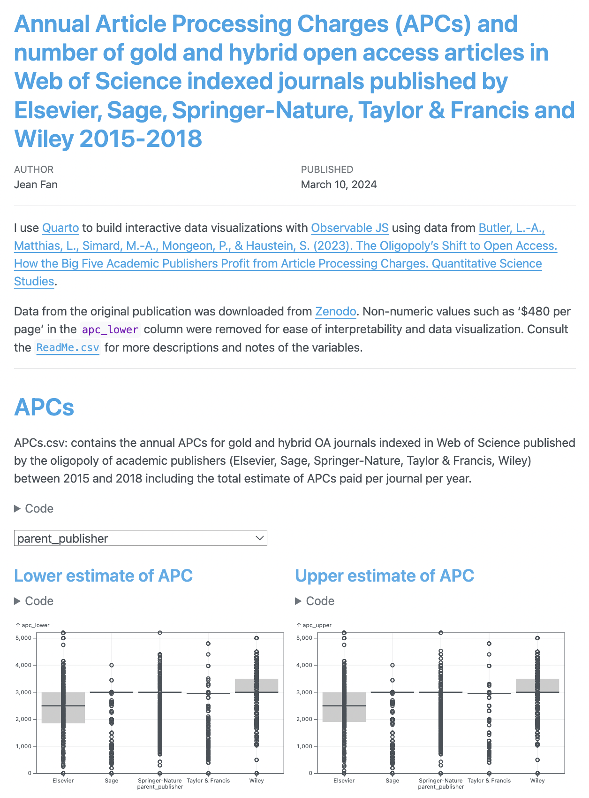

# Annual Article Processing Charges (APCs) and number of gold and hybrid open access articles in Web of Science indexed journals published by Elsevier, Sage, Springer-Nature, Taylor & Francis and Wiley 2015-2018

I use [Quarto](https://quarto.org/) to build interactive data visualizations with [Observable JS](https://quarto.org/docs/interactive/ojs/ojs-cells.html) using data from [Butler, L.-A., Matthias, L., Simard, M.-A., Mongeon, P., & Haustein, S. (2023). The Oligopoly's Shift to Open Access. How the Big Five Academic Publishers Profit from Article Processing Charges. Quantitative Science Studies](https://direct.mit.edu/qss/article/4/4/778/118070/The-oligopoly-s-shift-to-open-access-How-the-big). 

<a href="https://jefworks.github.io/APC_quarto/">
https://jefworks.github.io/APC_quarto/
</a>